<div align="center">

# Hi 👋, I'm Shiv Shikhar Sinha

### Software Engineer | Java Backend Developer | Spring Boot | SQL

Building backend systems, learning distributed systems, and continuously improving my software engineering fundamentals.

</div>

---

## 👨‍💻 About Me

- 💼 I'm a Software Engineer focused on **Java backend development**
- ☕ Working with **Java, Spring Boot, REST APIs, SQL and backend application development**
- 🗄️ Building and working with **MySQL and relational databases**
- 🐳 Exploring **Docker, Podman and containerized development**
- 🔐 Learning and implementing **authentication, authorization, validation and exception handling**
- 🏗️ Currently building **Cartify**, a backend-focused project to strengthen my Spring Boot and backend engineering skills
- 🔄 Interested in **microservices, scalable backend architecture and clean code**
- 🧰 Comfortable working with **Git, GitHub, Maven, Postman and VS Code**
- 📚 Currently deepening my understanding of **Spring Boot, database integration, authentication/authorization and microservices**
- ⚡ Fun fact: I play **Harmonium** and **Football**

---

## 🛠️ Tech Stack

### Languages
<p>
  
  
  
  
  
  
</p>

### Backend & Frameworks
<p>
  
  
  
</p>

### Databases
<p>
  
  
  
</p>

### DevOps, Tools & Cloud
<p>
  
  
  
  
  
  
</p>

<p>
  
  
  
</p>

---

## 🚀 Current Focus

```text
Java
 └── Spring Boot
      ├── REST APIs
      ├── Validation & Exception Handling
      ├── Authentication & Authorization
      ├── MySQL Integration
      └── Backend Architecture

DevOps
 ├── Git & GitHub
 ├── Docker
 ├── Podman
 └── Kubernetes

Architecture
 └── Microservices
```

---

## 📌 Featured Project

### 🛒 Cartify — Backend

A backend project focused on building a production-style application with **Java and Spring Boot**.

Current development areas include:

- REST API development
- Request validation
- Exception handling
- MySQL/database integration
- Authentication & authorization
- Containerized development
- Clean backend architecture
- Git/GitHub based development workflow

> More features and services are being added as I continue improving the project.

---

## 🤝 Connect With Me

<p align="left">
  <a href="https://linkedin.com/in/shivshikharsinha">
    
  </a>
  <a href="https://github.com/shivshikharsinha">
    
  </a>
  <a href="mailto:shiv.shikhar.3@gmail.com">
    
  </a>
</p>

---

## 📊 GitHub Stats

<p align="center">
  
</p>

<p align="center">
  
</p>

<p align="center">
  
</p>

---

<div align="center">

### 💻 Keep Learning. Keep Building. Keep Improving.

</div>
